# 42Chips_Piscine_Embedded

## Demos

<details>
  <summary>Videos</summary>
  
  ### Module 0
  
https://github.com/user-attachments/assets/325890b8-ceb9-47ea-9f54-5eef4cc26c7f

https://github.com/user-attachments/assets/be04ae7d-ff0d-448a-a7fb-0e0570d4e0bb

https://github.com/user-attachments/assets/5f5fdadf-7e94-4246-8ccf-f0ef1af19e77

https://github.com/user-attachments/assets/d4ef1134-2ab1-446e-92c2-6f52f7f7dc4f

  ### Module 1

https://github.com/user-attachments/assets/5f0d355c-2910-4b3c-b0f0-31828c4b0394


https://github.com/user-attachments/assets/d25b66ca-62ea-4f10-ad16-1b328f6bb9ad


https://github.com/user-attachments/assets/223e556b-d993-4c9b-932a-b7eff8345cdf


https://github.com/user-attachments/assets/b3814409-27a9-455f-9256-7fcbaa910054

  ### Module 2


https://github.com/user-attachments/assets/b9d54bda-6438-47ae-bd51-fa96513460f1


https://github.com/user-attachments/assets/4117c7d1-5756-495a-895d-67f1036b5328


https://github.com/user-attachments/assets/da8a8327-9bef-4a7c-8479-3e5194c919f5


https://github.com/user-attachments/assets/7b7c2f7a-a553-4a88-974b-ffa8505b974b


https://github.com/user-attachments/assets/95f62df8-6c9f-4c32-a4e9-b009c4228b62

  ### Module 3


https://github.com/user-attachments/assets/95ad9898-f7c3-4381-afa2-81af43781ec6


https://github.com/user-attachments/assets/1b726003-d503-408a-81e9-7833ecf4779d


https://github.com/user-attachments/assets/b984a192-512a-41e3-8178-c43efbff6f13


https://github.com/user-attachments/assets/ac8ac8fc-9baf-4fba-ac33-d12cdd6bcf6b

  ### Module 4


https://github.com/user-attachments/assets/dba5c729-f53f-4a22-a9e8-5591b424c486


https://github.com/user-attachments/assets/97ba8f80-5ee9-4f04-bb1f-0ee419169477

  ### Module 5

https://github.com/user-attachments/assets/f268b1ec-f48d-404b-b7dd-e8991efc632b


https://github.com/user-attachments/assets/9ea83631-e08e-46aa-91ee-ac23a1e32cac


https://github.com/user-attachments/assets/6953afb6-d99b-4aef-b800-e8022fb23949


https://github.com/user-attachments/assets/4cb6c8f7-de16-40af-812c-0c71f3d0ae7e


https://github.com/user-attachments/assets/43542f5f-8a1d-47f1-a1a9-b6e7455f35b9

  ### Module 6

https://github.com/user-attachments/assets/19c07fcd-5494-416d-94c8-6fa50efd1941


https://github.com/user-attachments/assets/6f6c93b3-71a7-4657-9519-c7e180671e98


https://github.com/user-attachments/assets/bba4a182-004e-4e1c-a796-5f04b895814f


</details>


## Resources

- [AVR-Microcontroller-ATmega328P](https://docs.arduino.cc/resources/datasheets/Atmel-42735-8-bit-AVR-Microcontroller-ATmega328-328P_Datasheet.pdf)
  - [ATmega328P - Summary](https://docs.arduino.cc/resources/datasheets/Atmel-42735-8-bit-AVR-Microcontroller-ATmega328-328P_Datasheet.pdf#_OPENTOPIC_TOC_PROCESSING_d94e58732)
  - [Interrupt Vectors Table](https://docs.arduino.cc/resources/datasheets/Atmel-42735-8-bit-AVR-Microcontroller-ATmega328-328P_Datasheet.pdf#_OPENTOPIC_TOC_PROCESSING_d94e15100)
- [Calculator](https://www.rapidtables.com/convert/number/decimal-to-binary.html?x=16)

## Config

### VSCode

- [C/C++ Config]
  - Extension (ms-vscode.cpptools)
  ```vscode
  @ext:ms-vscode.cpptools
  ```
  - `c_cpp_properties.json`
  ```json
  {
    "configurations": [
      {
        "name": "linux-avr-gcc",
        "includePath": ["${workspaceFolder}/**", "/usr/lib/avr/include/**"],
        "defines": [],
        "mergeConfigurations": false,
        "compilerPath": "/usr/bin/avr-gcc",
        "cStandard": "gnu11",
        "cppStandard": "gnu++17",
        "intelliSenseMode": "linux-gcc-x64",
        "compilerArgs": ["-mmcu=atmega328p", "-DF_CPU=16000000UL", "-Os"],
        "browse": {
          "path": ["${workspaceFolder}"],
          "limitSymbolsToIncludedHeaders": true
        }
      }
    ],
    "version": 4
  }
  ```

## Information

### AVR

- [AVR Programming](https://www.instructables.com/AVR-Programming-with-Arduino-AVRdude-and-AVR-gcc/)

- AVR stands for Alf and Vegard's RISC processor
- `avr-gcc` is a compiler that takes C code and turns it into machine code that the AVR microcontroller can execute
  - `mmcu=atmega328p` specifies the microcontroller model
  - `-Os` optimizes the code for size
  - `-DF_CPU=16000000UL` specifies the clock speed of the microcontroller
  - `-o` specifies the output file


- ELF (Executable and Linkable Format) is a standard file format for executables, object code, shared libraries, and core dumps
- HEX (Intel Hexadecimal Object File Format) is a file format that conveys binary information in ASCII text form
- `avr-objcopy` is a utility program that copies only the parts of the object files that are needed
  - `-O ihex` specifies the output format as Intel HEX
  - `-R .eeprom` removes the EEPROM data from the HEX file
    - EEPROM (Electrically Erasable Programmable Read-Only Memory) is a type of non-volatile memory used in computers and other electronic devices to store small amounts of data that must be saved when power is removed
- `avrdude` is a utility program that ahttps://www.rapidtables.com/convert/number/decimal-to-binary.html?x=16

#### AVR Libraries

##### AVR I/O

- `avr/io.h` is a library that provides access to the I/O registers of the AVR microcontroller
- I/O registers are memory locations that control the behavior of the microcontroller
  - I/O registers are used to configure the pins of the microcontroller as inputs or outputs, read the state of the pins, and write data to the pins

```mermaid
flowchart LR
    classDef main fill:#1976d2,stroke:#01579b,stroke-width:2px,color:#ffffff
    classDef included fill:#6a1b9a,stroke:#4a148c,stroke-width:2px,color:#ffffff
    classDef purpose fill:#ffffff,stroke:#616161,stroke-width:1px,color:#000000,text-align:left

    io["<b>avr/io.h</b><br/><i>Main Header File</i>"]:::main

    subgraph Included_Files["Included Components"]
        direction TB
        sfr["<b>sfr_defs.h</b><br/>Special Function Registers"]:::included
        pins["<b>portpins.h</b><br/>Port Pin Definitions"]:::included
        common["<b>common.h</b><br/>Common Register Names"]:::included
        version["<b>version.h</b><br/>Version Information"]:::included
    end

    subgraph Purposes["Key Functions"]
        direction TB
        reg["Register Access<br/>• Direct register manipulation<br/>• Bit-level operations"]:::purpose
        def["Definitions<br/>• Device-specific mappings<br/>• Interrupt handling"]:::purpose
        prot["Protection<br/>• CCP mechanism support<br/>• Protected register writes"]:::purpose
    end

    io --> Included_Files
    io --> Purposes
```



#### AVR I/O Registers

##### IO Ports

| Register | Description             | Address | Bit 7 | Bit 6 | Bit 5 | Bit 4 | Bit 3 | Bit 2 | Bit 1 | Bit 0 |
| -------- | ----------------------- | ------- | ----- | ----- | ----- | ----- | ----- | ----- | ----- | ----- |
| DDRx     | Data Direction Register | 0x0A    | D7    | D6    | D5    | D4    | D3    | D2    | D1    | D0    |
| PORTx    | Port Output Register    | 0x0B    | P7    | P6    | P5    | P4    | P3    | P2    | P1    | P0    |
| PINx     | Port Input Register     | 0x09    | I7    | I6    | I5    | I4    | I3    | I2    | I1    | I0    |


- DDRx (Data Direction Register)
  - Controls whether each pin acts as input (0) or output (1)
  - Bit n controls pin n (e.g., DDRB0 controls PORTB0)
  - Writing 1 sets the corresponding pin as output
  - Writing 0 sets the corresponding pin as input
- PORTx (Port Register)
  - Controls the output value when a pin is configured as output
  - Can also enable/disable internal pull-up resistors for input pins
  - Bit n controls the output driver for pin n
- PINx (Pin Register)
  - Read-only register showing actual pin states
  - Always reflects the physical state of the pins
  - Bit n reads the state of pin n

[DDR-PORT-PIN](http://embeddedwithanshul.blogspot.com/2012/06/registers-ddr-port-pin.html)

#### AVR Timers

- Timers are used to generate precise time delays, measure time intervals, and control the frequency of waveforms
- Timers are implemented using Timer/Counter Registers
  - Timer/Counter Registers are memory locations that control the behavior of the timers
  - Timer/Counter Registers are used to configure the timers, read the current count value, and write new count values

##### Timer/Counter Registers

| Register | Description                  | Address | Bit 7  | Bit 6  | Bit 5  | Bit 4  | Bit 3  | Bit 2  | Bit 1  | Bit 0  |
| -------- | ---------------------------- | ------- | ------ | ------ | ------ | ------ | ------ | ------ | ------ | ------ |
| TCCRnA   | Timer/Counter Control Reg A  | 0x2n    | COMnA1 | COMnA0 | COMnB1 | COMnB0 | -      | -      | WGMn1  | WGMn0  |
| TCCRnB   | Timer/Counter Control Reg B  | 0x2n+1  | FOCnA  | FOCnB  | -      | -      | WGMn2  | CSn2   | CSn1   | CSn0   |
| TCNTn    | Timer/Counter Register       | 0x2n+2  | TCNTn7 | TCNTn6 | TCNTn5 | TCNTn4 | TCNTn3 | TCNTn2 | TCNTn1 | TCNTn0 |
| OCRnA    | Output Compare Reg A         | 0x2n+3  | OCRnA7 | OCRnA6 | OCRnA5 | OCRnA4 | OCRnA3 | OCRnA2 | OCRnA1 | OCRnA0 |
| OCRnB    | Output Compare Reg B         | 0x2n+4  | OCRnB7 | OCRnB6 | OCRnB5 | OCRnB4 | OCRnB3 | OCRnB2 | OCRnB1 | OCRnB0 |
| ICRn     | Input Capture Register       | 0x2n+4  | ICRn7  | ICRn6  | ICRn5  | ICRn4  | ICRn3  | ICRn2  | ICRn1  | ICRn0  |
| TIFRn    | Timer/Counter Interrupt Flag | 0x3n    | -      | -      | -      | -      | -      | -      | OCFnA  | OCFnB  |

- `n` is the timer number (e.g., Timer0, Timer1, Timer2)
- `COMnA1` and `COMnA0` control the output behavior of the `OCnA` pin
- `COMnB1` and `COMnB0` control the output behavior of the `OCnB` pin
- `WGMn2`, `WGMn1`, and `WGMn0` control the waveform generation mode
- `FOCnA` and `FOCnB` are used to force an output compare match
- `CSn2`, `CSn1`, and `CSn0` control the clock source
- `TCNTn` is the timer/counter register that holds the current count value
- `OCRnA` and `OCRnB` are the output compare registers that hold the comparison values
- `ICRn` is the input capture register that holds the capture value
- `OCFnA` and `OCFnB` are the output compare match flags

###### Prescaler

- The prescaler is a counter that divides the clock frequency before it reaches the timer
- The prescaler is used to reduce the clock frequency to a manageable level

  - This allows the timer to count at a slower rate
  - This prevents the timer from overflowing too quickly
    - Example: Timer1 is an 16-bit counter that can count up to $2^{16} = 65,536$
      - $F_{timer} = \frac{System\ clock}{Prescaler}$
      - $F_{timer} = \frac{16\ \text{MHz}}{1024} = 15.625\ \text{KHz}$
      - $T_{tick} = \frac{1}{15.625\ \text{KHz}} = 64\ \mu s$
      - $T_{total} = 64\mu s \times 65,536 = 4.194\ \text{s}$
      - The timer will overflow every 4.194 seconds

- The prescaler is controlled by the CSn2, CSn1, and CSn0 bits in the TCCRnB register

| CSn2 | CSn1 | CSn0 | Prescaler | Description      |
| ---- | ---- | ---- | --------- | ---------------- |
| 0    | 0    | 0    | 0         | No prescaling    |
| 0    | 0    | 0    | 1         | $clk_{I/O}$      |
| 0    | 0    | 1    | 8         | $clk_{I/O}$/8    |
| 0    | 1    | 0    | 64        | $clk_{I/O}$/64   |
| 0    | 1    | 1    | 256       | $clk_{I/O}$/256  |
| 1    | 0    | 0    | 1024      | $clk_{I/O}$/1024 |


##### Waveform Generation Modes

- The waveform generation mode is controlled by the WGMn2, WGMn1
  , and WGMn0 bits in the TCCRnA and TCCRnB registers
- The waveform generation mode determines how the timer counts and when it overflows
- There are several waveform generation modes available
  - Normal Mode
  - CTC (Clear Timer on Compare Match) Mode
  - Fast PWM Mode
  - Phase Correct PWM Mode
- PWM: Pulse Width Modulation
  - PWM is a technique used to generate analog-like signals using digital outputs
  - The frequency of the signal is controlled by changing the period of the pulse


- Normal Mode
  - The timer counts from 0 to 255 (8-bit) or 65,535 (16-bit) and then overflows
  - The timer overflows when it reaches the maximum count value
  - The timer is reset to 0 after overflowing
- CTC Mode
  - The timer counts from 0 to a comparison value and then resets
  - The timer resets when it reaches the comparison value
  - The timer is reset to 0 after resetting
    
- Fast PWM Mode
  - The timer counts from 0 to 255 (8-bit) or 65,535 (16-bit) and then overflows
  - The timer overflows when it reaches the maximum count value
  - The timer is reset to 0 after overflowing
  - The output pin is set high when the timer is less than the comparison value
  - The output pin is set low when the timer is greater than the comparison value
- Phase Correct PWM Mode
  - The timer counts up to the comparison value and then counts down to 0
  - The timer counts up when the timer is less than the comparison value
  - The timer counts down when the timer is greater than the comparison value
  - The output pin is set high when the timer is less than the comparison value
  - The output pin is set low when the timer is greater than the comparison value

#### UART Protocol

- [UART - Wiki](https://en.wikipedia.org/wiki/Universal_asynchronous_receiver-transmitter)
- [UART - Understanding](https://www.rohde-schwarz.com/us/products/test-and-measurement/essentials-test-equipment/digital-oscilloscopes/understanding-uart_254524.html)


- UART (**Universal Asynchronous Receiver/Transmitter**) is a serial communication protocol used to transfer data between devices
- UART is asynchronous, meaning that the data is transmitted without a clock signal
- UART uses two pins: **TX (Transmit) and RX (Receive)**
- UART data is transmitted one bit at a time, **starting with the least significant bit (LSB)**
- UART data is transmitted in frames, with each frame consisting of a start bit, data bits, parity bit, and stop bit


- The start bit signals the beginning of the frame (always 0)
- The data bits contain the actual data being transmitted
- The parity bit is used for error checking (even, odd, or none)
- The stop bit signals the end of the frame (always 1)


- The baud rate is important for UART communication
  - The baud rate is the number of bits transmitted per second
  - The baud rate determines the speed of the communication
  - The baud rate must be the **same on both the transmitter and receiver**
- The baud rate is calculated as follows:
  - $Baud\ Rate = \frac{Clock\ Frequency}{16 \times (UBRRn + 1)}$
  - $UBRRn = \frac{Clock\ Frequency}{16 \times Baud\ Rate} - 1$
    - $UBRRn$ is the UART Baud Rate Register

#### AVR Interrupts

- [Interrupts - AVR](http://exploreembedded.com/wiki/Basics_of_AVR_Interrupts)
- An interrupt is a signal that informs the microcontroller that a specific event has occurred
- Interrupts allow the microcontroller to respond to external events in real-time

##### Types of Interrupts

- **External Interrupts**
  - External interrupts are triggered by external events
  - External interrupts can be triggered by changes on specific pins
  - External interrupts can be used to wake the microcontroller from sleep mode
- **Timer Interrupts**
  - Timer interrupts are triggered by timer events
  - Timer interrupts can be used to generate precise time delays
  - Timer interrupts can be used to control the frequency of waveforms
- **USART Interrupts**
  - USART interrupts are triggered by UART events
  - USART interrupts can be used to handle incoming and outgoing data
  - USART interrupts can be used to implement a serial communication protocol

##### Interrupt Vector Table

- The interrupt vector table is a table of addresses that point to the interrupt service routines (ISRs)
- The interrupt vector table is located at the beginning of the program memory

[Interrupt Vectors Table](https://docs.arduino.cc/resources/datasheets/Atmel-42735-8-bit-AVR-Microcontroller-ATmega328-328P_Datasheet.pdf#_OPENTOPIC_TOC_PROCESSING_d94e15100)
| Vector | Address | Code | Description |
| ------ | ------- | ---------- | ----------------------- |
| 0 | 0x0000 | RESET | Reset |
| 1 | 0x0002 | INT0 | External Interrupt 0 |
| 2 | 0x0004 | INT1 | External Interrupt 1 |
| 3 | 0x0006 | INT2 | External Interrupt 2 |
| ... | ... | ... | ... |
| 17 | 0x0012 | TIMER0_OVF | Timer/Counter0 Overflow |
| ... | ... | ... | ... |

##### Enabling Interrupts

- To enable interrupts, the **Global Interrupt Enable (I)** bit in the **Status Register (SREG)** must be **set**

```c
#include <avr/interrupt.h>

int main(void) {
    sei(); // Enable global interrupts
    ...
}
```

- To enable a specific interrupt, the Interrupt Enable (IEn) bit in the Interrupt Mask Register (pIMSK) must be set

```c
#include <avr/interrupt.h>

int main(void) {
    TIMSK |= (1 << TOIE0); // Enable Timer/Counter0 Overflow Interrupt
    ...
}
```

- To disable a specific interrupt, the Interrupt Enable (IEn) bit in the Interrupt Mask Register (pIMSK) must be cleared

```c
#include <avr/interrupt.h>

int main(void) {
    TIMSK &= ~(1 << TOIE0); // Disable Timer/Counter0 Overflow Interrupt
    ...
}
```

##### Interrupt Service Routines

- An **Interrupt Service Routine (ISR)** is a **function** that is called when an interrupt occurs
  - The ISR is executed in response to the interrupt
- The ISR must be defined using the **ISR** macro
  - The ISR macro specifies the vector name for the interrupt

```c
#include <avr/interrupt.h>

ISR(TIMER0_OVF_vect) {
    // Timer/Counter0 Overflow Interrupt
    ...
}
```

- The ISR macro is used to define an ISR
  - Example: The TIMER0_OVF_vect is the vector name for the Timer/Counter0 Overflow Interrupt

#### AVR Analog-to-Digital Converter (ADC)

References:

- [ADC - Wiki](https://en.wikipedia.org/wiki/Analog-to-digital_converter)
- [ADC - AVR](https://ece-classes.usc.edu/ee459/library/documents/ADC.pdf)

Infos:

- The Analog-to-Digital Converter (ADC) is used to convert analog signals into digital values
- The ADC is used to measure analog signals from sensors, transducers, and other devices
- The ADC converts the analog signal into a digital value that can be processed by the microcontroller

#### I2C Protocol

- [I2C - Wiki](https://en.wikipedia.org/wiki/I%C2%B2C)
- [I2C - Introduction - Circuitbasics](https://www.circuitbasics.com/basics-of-the-i2c-communication-protocol/)


Infos:

- I2C (Inter-Integrated Circuit) is a serial communication protocol used to transfer data between devices
- I2C is a two-wire bus protocol that uses a clock signal (SCL) and a data signal (SDA)
  - SCL: Serial Clock Line
  - SDA: Serial Data Line
- I2C is a master-slave protocol where the master device initiates the communication
- I2C devices are connected in a multi-master configuration, allowing multiple devices to communicate on the same bus

I2C communication follows a specific protocol structure:

- Message Structure:
  - Messages begin with a START condition
  - Include an address frame identifying the target device
  - Contain data frames (8 bits each)
  - End with a STOP condition
- Data Transfer Process:
  - Master devices control the clock signal (SCL)
  - Slave devices respond to their addresses
  - Each byte transfer includes acknowledgment (ACK/NACK)
  - Multiple bytes can be transferred in a single message


Advantages:

- Minimal wiring requirements (only two wires needed)
- Support for multiple devices on the same bus
- Flexible addressing system (7-bit or 10-bit)
- Low hardware overhead
- Bidirectional communication capability

Limitations:

- Limited speed compared to other protocols like SPI
- Restricted bus length due to capacitance limitations
- Potential bus contention issues with multiple masters
- Requires proper pull-up resistor configuration

### Logic Gates

- [Logic Gate](https://en.wikipedia.org/wiki/Logic_gate)
- [Logic Gate - Simulator](https://logic.ly/demo)

#### Flip-Flop

- [Flip-Flop - Wiki](<https://en.wikipedia.org/wiki/Flip-flop_(electronics)>)
- [Flip-Flop - Detailled - T,D,JK](https://www.electronicsforu.com/technology-trends/learn-electronics/flip-flop-rs-jk-t-d)
- JK Flip-Flop
  

  -
  - Truth table:
    | J | K | Q(t) | Q(t+1) | Comment |
    |---|---|------|--------| ------- |
    | 0 | 0 | Q | Q | No change |
    | 0 | 1 | Q | 0 | Reset |
    | 1 | 0 | Q | 1 | Set |
    | 1 | 1 | Q | !Q | Toggle |

- T Flip-Flop
  

  - Truth table:
    | T | Q(t) | Q(t+1) | Comment |
    |---|------|--------| ------- |
    | 0 | Q | Q | No change |
    | 1 | Q | !Q | Toggle |

- D Flip-Flop
  
  - Truth table:
    | D | Q(t) | Q(t+1) | Comment |
    |---|------|--------| ------- |
    | 0 | Q | 0 | Reset |
    | 1 | Q | 1 | Set |

## Bitwise Operations

[BitWise op in embedded programming](https://binaryupdates.com/bitwise-operations-in-embedded-programming/)

| Operation   | Symbol | Purpose                | Description                     | Example             |
| ----------- | ------ | ---------------------- | ------------------------------- | ------------------- |
| AND         | &      | Compare bits           | returns 1 if both bits are 1    | 1010 & 1100 = 1000  |
| OR          | \|     | Set bits               | returns 1 if any bit is 1       | 1010 \| 1100 = 1110 |
| XOR         | ^      | Toggle bits            | returns 1 if bits are different | 1010 ^ 1100 = 0110  |
| NOT         | ~      | Invert bits            | returns 1 if bit is 0           | ~1010 = 0101        |
| Left Shift  | <<     | Multiply by power of 2 | moves bits to the left          | 1010 << 1 = 10100   |
| Right Shift | >>     | Divide by power of 2   | moves bits to the right         | 1010 >> 1 = 0101    |

### Bit manipulation

<table>
  <thead>
    <tr>
      <th>Pattern</th>
      <th>Description</th>
      <th>Example</th>
    </tr>
  </thead>
  <tbody>
    <tr>
      <td><code>1 << n</code></td>
      <td>Mask Set bit n</td>
      <td>
      
```c
n = 3
1 << 3 = 00001000
```
</td>
    </tr>
    <tr>
      <td><code>~(1 << n)</code></td>
      <td>Mask Clear bit n</td>
      <td>

```c
n = 3
~(1 << 3) = 11110111
```

</td>
    </tr>
    <tr>
      <td><code>x & (1 << n)</code></td>
      <td>Check bit n</td>
      <td>

```c
x = 1010
n = 3
x & (1 << 3)
1010 & 1000 = 1000
```

</td>
    </tr>
    <tr>
      <td><code>x | (1 << n)</code></td>
      <td>Set bit n</td>
      <td>

```c
x = 1010
n = 2
x | (1 << 2)
1010 | 0100 = 1110
```

</td>
    </tr>
    <tr>
      <td><code>x & ~(1 << n)</code></td>
      <td>Clear bit n</td>
      <td>

```c
x = 1010
n = 1
x & ~(1 << 1)
1010 & 1101 = 1000
```

</td>
    </tr>
    <tr>
      <td><code>x ^ (1 << n)</code></td>
      <td>Toggle bit n</td>
      <td>

```c
x = 1010
n = 1
x ^ (1 << 1)
1010 ^ 0010 = 1000
```

</td>
    </tr>
    <tr>
      <td><code>x & ((1 << n) - 1)</code></td>
      <td>Clear bits above n</td>
      <td>

```c
x = 1110
n = 2
x & ((1 << 2) - 1)
1110 & (0100 - 1) = 1110 & 0011 = 0010
```

</td>
    </tr>
    <tr>
      <td><code>x & ~((1 << n) - 1)</code></td>
      <td>Clear bits below n</td>
      <td><code>x & ~((1 << 3) - 1)</code></td>
    </tr>
    <tr>
      <td><code>x & ((1 << (n + 1)) - 1)</code></td>
      <td>Clear bits above and including n</td>
      <td><code>x & ((1 << (3 + 1)) - 1)</code></td>
    </tr>
    <tr>
      <td><code>x & ~((1 << (n + 1)) - 1)</code></td>
      <td>Clear bits below and including n</td>
      <td><code>x & ~((1 << (3 + 1)) - 1)</code></td>
    </tr>
  </tbody>
</table>

## Modules

### Module 00

- [Info - AVR Programming](https://www.instructables.com/AVR-Programming-with-Arduino-AVRdude-and-AVR-gcc/)

- Find the USB port

  ```bash
  # List all USB devices
  lsusb

  # List all USB serial devices
  ls /dev/ttyUSB*

  # Show detailed device information
  dmesg | grep tty
  ```

- Include the necessary libraries `<avr/io.h>`
- PB0 is the LED pin here (same search for other pins)

  - ICP1/CLKO/PCINT0 – Port B, Bit 0
  - ICP1: Input Capture Pin. The PB0 pin can act as an Input Capture Pin for Timer/Counter1.
  - CLKO: Divided System Clock. The divided system clock can be output on the PB0 pin. The divided system clock will be output if the CKOUT Fuse is programmed, regardless of the PORTB0 and DDB0 settings. It will also be output during reset.
  - PCINT0: Pin Change Interrupt source 0. The PB0 pin can serve as an external interrupt
    source.
  - 📑 : Atmel ATmega328/P [DATASHEET] Atmel-42735B-ATmega328/P_Datasheet_Complete-11/2016 page 106)

### Module 01

Infos about frequency and time:

- `1Hz` = 1s = 1000ms
  - `1kHz` = 1,000Hz = 1ms
  - `1MHz` = 1,000,000Hz = 1µs
- `1 tick` = One cycle of the system clock
  - For a 16MHz Clock = 16,000,000 ticks per second
  - 1 tick = 1 / 16,000,000 seconds = 0.0625µs = 62.5ns
  - 1 tick = around 1-2 instructions
- **Clock** counter
  - Different counters have different maximum values
    - 8-bit counter = 256 ticks
    - 16-bit counter = 65,536 ticks
  - So using prescaling is important to avoid overflow
- Prescaling: Allow to skip a certain number of ticks
  - **Prescaler** values: `1, 8, 64, 256, 1024` (AVR Microcontrollers)
  - Example:
    - 16MHz / 1 = 16,000,000Hz = 62.5ns
    - 16MHz / 8 = 2,000,000Hz = 0.5µs
    - 16MHz / 64 = 250,000Hz = 4µs
    - 16MHz / 256 = 62,500Hz = 16µs
    - 16MHz / 1024 = 15,625Hz = 64µs

Delay in code :

- [Microcontrollers - Timers Counters - Instructables](https://www.instructables.com/Beginning-Microcontrollers-Part-11-Timers-Counters/)
- [Builtin AVR Functions - GNU GCC Docs](https://gcc.gnu.org/onlinedocs/gcc/AVR-Built-in-Functions.html)
- `__builtin_avr_delay_cycles`

  - `void __builtin_avr_delay_cycles (uint32_t ticks)`
  - Delays the specified number of CPU cycles.
  - The delay parameter must be a compile-time constant.

Timer registers:

- [AVR - Timer programming - ExploreEmbedded](https://exploreembedded.com/wiki/AVR_Timer_programming)


- LED at 1Hz = 1s (0.5s ON, 0.5s OFF)

  - $F_{timer} = \frac{F_{CPU}}{Prescaler}$
  - $F_{timer} = \frac{16\ \text{MHz}}{1024} = 15.625\ \text{KHz}$
  - $T_{tick} = \frac{1}{15.625\ \text{KHz}} = 64\ \mu s$
  - $Cycles/Count = \frac{Wait\ Time}{T_{tick}} = \frac{1\ s}{64\ \mu s} = 15625$
  - $Cycles/Count = \frac{Wait\ Time}{T_{tick}} = \frac{0.5\ s}{64\ \mu s} = 7812.5$

- Duty Cycle

  - Pulse Width(PW) to Total period (T) of the Waveform/Signal
    - Generally expressed in percentage
    - Represents the amount of time the signal is high(1) compared to the total time
  - $Duty\ Cycle = \frac{PW}{T} $
  - $Duty\ Cycle = \frac{ON\ Time}{Total\ Time} = \frac{ON\ Time}{ON\ Time + OFF\ Time}$
    - $Duty\ Cycle = \frac{1\ s}{1\ s + 1\ s} = 50\ \%$

- $F_{desired} = \frac{F_{CPU}}{Prescaler \times (1 + TOP)}$
  - $TOP = \frac{F_{CPU}}{F_{desired} \times Prescaler} - 1$
  - $TOP = \frac{16\ \text{MHz}}{1\ \text{Hz} \times 1024} - 1 = 15624$
    - $-1$ because the counter starts from 0


### Module02: UART Protocol

```bash
# Screen : is a full-screen window manager that multiplexes a physical terminal between several processes
# Listen to the serial port (ttyUSB0) with baud rate 115200
screen /dev/ttyUSB0 115200
```

```bash
# Kill the screen session
Ctrl + A + K

# Detach the screen session
Ctrl + A + D

# List available sessions
screen -ls

# Reattach to a session (if only one exists)
screen -r

# Reattach to a specific session
screen -r session_id

# Kill a specific session
screen -X -S session_id quit
```

[UART - AVR - Guide for use](http://www.rjhcoding.com/avrc-uart.php)
[UART - AVR - Interrupts](http://www.rjhcoding.com/avrc-uart-interrupts.php)

Ex01: Transmitting


### Module03: AVR Timers

### Module04: AVR Interrupts

### Module05: AVR ADC


- $ADC = \frac{V_{in} \times 1024}{V_{ref}}$

  - $V_{in}$: Input Voltage
  - $V_{ref}$: Reference Voltage
  - $1024$: Resolution (10-bit ADC: $2^{10} = 1024$)

- [Atmega328p - Internal Temperature - datasheet](https://ww1.microchip.com/downloads/en/DeviceDoc/Atmel-7810-Automotive-Microcontrollers-ATmega328P_Datasheet.pdf#G1202793)

### Module06: I2C Protocol


- $F_{SCL} = \frac{F_{CPU}}{16 + 2 \times TWBR \times Prescaler}$

  - $TWBR = \text{Value in TW Bit Rate Register}$
  - $TWBR = \frac{(F_{CPU} / F_{SCL}) - 16}{2 \times Prescaler}$

- [I2C - AHT20 - Datasheet - Recommanded section 7.4](http://www.aosong.com/userfiles/files/media/Data%20Sheet%20AHT20.pdf)


- $RH = (\frac{S_{RH}}{2^{20}}) \times 100 \text{ \%}$
  - $S_{RH}$: Signal Relative Humidity Value
- $T = (\frac{S_{T}}{2^{20}}) \times 200 - 50 \text{ °C}$
  - $S_{T}$: Signal Temperature Value
