# 42Chips_Piscine_Embedded


## Resources

- [AVR-Microcontroller-ATmega328P](https://docs.arduino.cc/resources/datasheets/Atmel-42735-8-bit-AVR-Microcontroller-ATmega328-328P_Datasheet.pdf)
- [Calculator](https://www.rapidtables.com/convert/number/decimal-to-binary.html?x=16)

## Config

### VSCode

- [C/C++ config]

```vscode
@ext:ms-vscode.cpptools
```

## Information

### AVR Programming

- [AVR Programming](https://www.instructables.com/AVR-Programming-with-Arduino-AVRdude-and-AVR-gcc/)

- AVR stands for Alf and Vegard's RISC processor
- `avr-gcc` is a compiler that takes C code and turns it into machine code that the AVR microcontroller can execute
  - `mmcu=atmega328p` specifies the microcontroller model
  - `-Os` optimizes the code for size
  - `-DF_CPU=16000000UL` specifies the clock speed of the microcontroller
  - `-o` specifies the output file


- ELF (Executable and Linkable Format) is a standard file format for executables, object code, shared libraries, and core dumps
- HEX (Intel Hexadecimal Object File Format) is a file format that conveys binary information in ASCII text form
- `avr-objcopy` is a utility program that copies only the parts of the object files that are needed
  - `-O ihex` specifies the output format as Intel HEX
  - `-R .eeprom` removes the EEPROM data from the HEX file
    - EEPROM (Electrically Erasable Programmable Read-Only Memory) is a type of non-volatile memory used in computers and other electronic devices to store small amounts of data that must be saved when power is removed
- `avrdude` is a utility program that ahttps://www.rapidtables.com/convert/number/decimal-to-binary.html?x=16

#### AVR Libraries

##### AVR I/O

- `avr/io.h` is a library that provides access to the I/O registers of the AVR microcontroller
- I/O registers are memory locations that control the behavior of the microcontroller
  - I/O registers are used to configure the pins of the microcontroller as inputs or outputs, read the state of the pins, and write data to the pins

```mermaid
flowchart LR
    classDef main fill:#1976d2,stroke:#01579b,stroke-width:2px,color:#ffffff
    classDef included fill:#6a1b9a,stroke:#4a148c,stroke-width:2px,color:#ffffff
    classDef purpose fill:#ffffff,stroke:#616161,stroke-width:1px,color:#000000,text-align:left

    io["<b>avr/io.h</b><br/><i>Main Header File</i>"]:::main

    subgraph Included_Files["Included Components"]
        direction TB
        sfr["<b>sfr_defs.h</b><br/>Special Function Registers"]:::included
        pins["<b>portpins.h</b><br/>Port Pin Definitions"]:::included
        common["<b>common.h</b><br/>Common Register Names"]:::included
        version["<b>version.h</b><br/>Version Information"]:::included
    end

    subgraph Purposes["Key Functions"]
        direction TB
        reg["Register Access<br/>• Direct register manipulation<br/>• Bit-level operations"]:::purpose
        def["Definitions<br/>• Device-specific mappings<br/>• Interrupt handling"]:::purpose
        prot["Protection<br/>• CCP mechanism support<br/>• Protected register writes"]:::purpose
    end

    io --> Included_Files
    io --> Purposes
```



#### AVR I/O Registers

##### IO Ports

| Register | Description             | Address | Bit 7 | Bit 6 | Bit 5 | Bit 4 | Bit 3 | Bit 2 | Bit 1 | Bit 0 |
| -------- | ----------------------- | ------- | ----- | ----- | ----- | ----- | ----- | ----- | ----- | ----- |
| DDRx     | Data Direction Register | 0x0A    | D7    | D6    | D5    | D4    | D3    | D2    | D1    | D0    |
| PORTx    | Port Output Register    | 0x0B    | P7    | P6    | P5    | P4    | P3    | P2    | P1    | P0    |
| PINx     | Port Input Register     | 0x09    | I7    | I6    | I5    | I4    | I3    | I2    | I1    | I0    |


- DDRx (Data Direction Register)
  - Controls whether each pin acts as input (0) or output (1)
  - Bit n controls pin n (e.g., DDRB0 controls PORTB0)
  - Writing 1 sets the corresponding pin as output
  - Writing 0 sets the corresponding pin as input
- PORTx (Port Register)
  - Controls the output value when a pin is configured as output
  - Can also enable/disable internal pull-up resistors for input pins
  - Bit n controls the output driver for pin n
- PINx (Pin Register)
  - Read-only register showing actual pin states
  - Always reflects the physical state of the pins
  - Bit n reads the state of pin n

[DDR-PORT-PIN](http://embeddedwithanshul.blogspot.com/2012/06/registers-ddr-port-pin.html)

### Logic Gates

- [Logic Gate](https://en.wikipedia.org/wiki/Logic_gate)
- [Logic Gate - Simulator](https://logic.ly/demo)

#### Flip-Flop

- [Flip-Flop - Wiki](<https://en.wikipedia.org/wiki/Flip-flop_(electronics)>)
- [Flip-Flop - Detailled - T,D,JK](https://www.electronicsforu.com/technology-trends/learn-electronics/flip-flop-rs-jk-t-d)
- JK Flip-Flop
  

  -
  - Truth table:
    | J | K | Q(t) | Q(t+1) | Comment |
    |---|---|------|--------| ------- |
    | 0 | 0 | Q | Q | No change |
    | 0 | 1 | Q | 0 | Reset |
    | 1 | 0 | Q | 1 | Set |
    | 1 | 1 | Q | !Q | Toggle |

- T Flip-Flop
  

  - Truth table:
    | T | Q(t) | Q(t+1) | Comment |
    |---|------|--------| ------- |
    | 0 | Q | Q | No change |
    | 1 | Q | !Q | Toggle |

- D Flip-Flop
  
  - Truth table:
    | D | Q(t) | Q(t+1) | Comment |
    |---|------|--------| ------- |
    | 0 | Q | 0 | Reset |
    | 1 | Q | 1 | Set |

## Bitwise Operations

[BitWise op in embedded programming](https://binaryupdates.com/bitwise-operations-in-embedded-programming/)

| Operation   | Symbol | Purpose                | Description                     | Example             |
| ----------- | ------ | ---------------------- | ------------------------------- | ------------------- |
| AND         | &      | Compare bits           | returns 1 if both bits are 1    | 1010 & 1100 = 1000  |
| OR          | \|     | Set bits               | returns 1 if any bit is 1       | 1010 \| 1100 = 1110 |
| XOR         | ^      | Toggle bits            | returns 1 if bits are different | 1010 ^ 1100 = 0110  |
| NOT         | ~      | Invert bits            | returns 1 if bit is 0           | ~1010 = 0101        |
| Left Shift  | <<     | Multiply by power of 2 | moves bits to the left          | 1010 << 1 = 10100   |
| Right Shift | >>     | Divide by power of 2   | moves bits to the right         | 1010 >> 1 = 0101    |

### Bit manipulation

<table>
  <thead>
    <tr>
      <th>Pattern</th>
      <th>Description</th>
      <th>Example</th>
    </tr>
  </thead>
  <tbody>
    <tr>
      <td><code>1 << n</code></td>
      <td>Mask Set bit n</td>
      <td>
      
```c
n = 3
1 << 3 = 00001000
```
</td>
    </tr>
    <tr>
      <td><code>~(1 << n)</code></td>
      <td>Mask Clear bit n</td>
      <td>

```c
n = 3
~(1 << 3) = 11110111
```

</td>
    </tr>
    <tr>
      <td><code>x & (1 << n)</code></td>
      <td>Check bit n</td>
      <td>

```c
x = 1010
n = 3
x & (1 << 3)
1010 & 1000 = 1000
```

</td>
    </tr>
    <tr>
      <td><code>x | (1 << n)</code></td>
      <td>Set bit n</td>
      <td>

```c
x = 1010
n = 2
x | (1 << 2)
1010 | 0100 = 1110
```

</td>
    </tr>
    <tr>
      <td><code>x & ~(1 << n)</code></td>
      <td>Clear bit n</td>
      <td>

```c
x = 1010
n = 1
x & ~(1 << 1)
1010 & 1101 = 1000
```

</td>
    </tr>
    <tr>
      <td><code>x ^ (1 << n)</code></td>
      <td>Toggle bit n</td>
      <td>

```c
x = 1010
n = 1
x ^ (1 << 1)
1010 ^ 0010 = 1000
```

</td>
    </tr>
    <tr>
      <td><code>x & ((1 << n) - 1)</code></td>
      <td>Clear bits above n</td>
      <td>

```c
x = 1110
n = 2
x & ((1 << 2) - 1)
1110 & (0100 - 1) = 1110 & 0011 = 0010
```

</td>
    </tr>
    <tr>
      <td><code>x & ~((1 << n) - 1)</code></td>
      <td>Clear bits below n</td>
      <td><code>x & ~((1 << 3) - 1)</code></td>
    </tr>
    <tr>
      <td><code>x & ((1 << (n + 1)) - 1)</code></td>
      <td>Clear bits above and including n</td>
      <td><code>x & ((1 << (3 + 1)) - 1)</code></td>
    </tr>
    <tr>
      <td><code>x & ~((1 << (n + 1)) - 1)</code></td>
      <td>Clear bits below and including n</td>
      <td><code>x & ~((1 << (3 + 1)) - 1)</code></td>
    </tr>
  </tbody>
</table>

## Modules

### Module 00

- [Info - AVR Programming](https://www.instructables.com/AVR-Programming-with-Arduino-AVRdude-and-AVR-gcc/)

- Find the USB port

  ```bash
  # List all USB devices
  lsusb

  # List all USB serial devices
  ls /dev/ttyUSB*

  # Show detailed device information
  dmesg | grep tty
  ```

- Include the necessary libraries `<avr/io.h>`
- PB0 is the LED pin here (same search for other pins)

  - ICP1/CLKO/PCINT0 – Port B, Bit 0
  - ICP1: Input Capture Pin. The PB0 pin can act as an Input Capture Pin for Timer/Counter1.
  - CLKO: Divided System Clock. The divided system clock can be output on the PB0 pin. The divided system clock will be output if the CKOUT Fuse is programmed, regardless of the PORTB0 and DDB0 settings. It will also be output during reset.
  - PCINT0: Pin Change Interrupt source 0. The PB0 pin can serve as an external interrupt
    source.
  - 📑 : Atmel ATmega328/P [DATASHEET] Atmel-42735B-ATmega328/P_Datasheet_Complete-11/2016 page 106)

### Module 01

Infos about frequency and time:

- `1Hz` = 1s = 1000ms
  - `1kHz` = 1,000Hz = 1ms
  - `1MHz` = 1,000,000Hz = 1µs
- `1 tick` = One cycle of the system clock
  - For a 16MHz Clock = 16,000,000 ticks per second
  - 1 tick = 1 / 16,000,000 seconds = 0.0625µs = 62.5ns
  - 1 tick = around 1-2 instructions
- **Clock** counter
  - Different counters have different maximum values
    - 8-bit counter = 256 ticks
    - 16-bit counter = 65,536 ticks
  - So using prescaling is important to avoid overflow
- Prescaling: Allow to skip a certain number of ticks
  - **Prescaler** values: `1, 8, 64, 256, 1024` (AVR Microcontrollers)
  - Example:
    - 16MHz / 1 = 16,000,000Hz
    - 16MHz / 8 = 2,000,000Hz
    - 16MHz / 64 = 250,000Hz
    - 16MHz / 256 = 62,500Hz
    - 16MHz / 1024 = 15,625Hz

Applying in code :

- [Microcontrollers - Timers Counters - Instructables](https://www.instructables.com/Beginning-Microcontrollers-Part-11-Timers-Counters/)
- [Builtin AVR Functions - GNU GCC Docs](https://gcc.gnu.org/onlinedocs/gcc/AVR-Built-in-Functions.html)
- `__builtin_avr_delay_cycles`
  - `void __builtin_avr_delay_cycles (uint32_t ticks)`
  - Delays the specified number of CPU cycles.
  - The delay parameter is a constant unsigned long integer, which specifies the number of CPU cycles to delay.
  - The delay parameter must be a compile-time constant.
  - The delay parameter must be greater than or equal to 1.
  - The delay parameter must be less than or equal to 65535.
  - The delay parameter is rounded up to the nearest multiple of 3.
  - The delay parameter is divided by 3 to determine the number of NOP instructions to insert.
    - The NOP instruction is a single-cycle instruction that does nothing.
