# 42Chips_Piscine_Embedded


## Resources

- [AVR-Microcontroller-ATmega328P](https://docs.arduino.cc/resources/datasheets/Atmel-42735-8-bit-AVR-Microcontroller-ATmega328-328P_Datasheet.pdf)

## Config

### VSCode

- [C/C++ config]

```vscode
@ext:ms-vscode.cpptools
```

## Information

### AVR Programming

- [AVR Programming](https://www.instructables.com/AVR-Programming-with-Arduino-AVRdude-and-AVR-gcc/)

- AVR stands for Alf and Vegard's RISC processor
- `avr-gcc` is a compiler that takes C code and turns it into machine code that the AVR microcontroller can execute
  - `mmcu=atmega328p` specifies the microcontroller model
  - `-Os` optimizes the code for size
  - `-DF_CPU=16000000UL` specifies the clock speed of the microcontroller
  - `-o` specifies the output file


- ELF (Executable and Linkable Format) is a standard file format for executables, object code, shared libraries, and core dumps
- HEX (Intel Hexadecimal Object File Format) is a file format that conveys binary information in ASCII text form
- `avr-objcopy` is a utility program that copies only the parts of the object files that are needed
  - `-O ihex` specifies the output format as Intel HEX
  - `-R .eeprom` removes the EEPROM data from the HEX file
    - EEPROM (Electrically Erasable Programmable Read-Only Memory) is a type of non-volatile memory used in computers and other electronic devices to store small amounts of data that must be saved when power is removed
- `avrdude` is a utility program that allows you to download/upload/manipulate the ROM and EEPROM contents of AVR microcontrollers
  - `-c` specifies the programmer type
  - `-b` specifies the baud rate
  - `-p` specifies the microcontroller model
  - `-P` specifies the port

#### AVR Libraries

##### AVR I/O

- `avr/io.h` is a library that provides access to the I/O registers of the AVR microcontroller
- I/O registers are memory locations that control the behavior of the microcontroller
  - I/O registers are used to configure the pins of the microcontroller as inputs or outputs, read the state of the pins, and write data to the pins

```mermaid
flowchart LR
    classDef main fill:#1976d2,stroke:#01579b,stroke-width:2px,color:#ffffff
    classDef included fill:#6a1b9a,stroke:#4a148c,stroke-width:2px,color:#ffffff
    classDef purpose fill:#ffffff,stroke:#616161,stroke-width:1px,color:#000000,text-align:left

    io["<b>avr/io.h</b><br/><i>Main Header File</i>"]:::main

    subgraph Included_Files["Included Components"]
        direction TB
        sfr["<b>sfr_defs.h</b><br/>Special Function Registers"]:::included
        pins["<b>portpins.h</b><br/>Port Pin Definitions"]:::included
        common["<b>common.h</b><br/>Common Register Names"]:::included
        version["<b>version.h</b><br/>Version Information"]:::included
    end

    subgraph Purposes["Key Functions"]
        direction TB
        reg["Register Access<br/>• Direct register manipulation<br/>• Bit-level operations"]:::purpose
        def["Definitions<br/>• Device-specific mappings<br/>• Interrupt handling"]:::purpose
        prot["Protection<br/>• CCP mechanism support<br/>• Protected register writes"]:::purpose
    end

    io --> Included_Files
    io --> Purposes
```



#### AVR I/O Registers

##### IO Ports

| Register | Description             | Address | Bit 7 | Bit 6 | Bit 5 | Bit 4 | Bit 3 | Bit 2 | Bit 1 | Bit 0 |
| -------- | ----------------------- | ------- | ----- | ----- | ----- | ----- | ----- | ----- | ----- | ----- |
| DDRx     | Data Direction Register | 0x0A    | D7    | D6    | D5    | D4    | D3    | D2    | D1    | D0    |
| PORTx    | Port Output Register    | 0x0B    | P7    | P6    | P5    | P4    | P3    | P2    | P1    | P0    |
| PINx     | Port Input Register     | 0x09    | I7    | I6    | I5    | I4    | I3    | I2    | I1    | I0    |


- DDRx (Data Direction Register)
  - Controls whether each pin acts as input (0) or output (1)
  - Bit n controls pin n (e.g., DDRB0 controls PORTB0)
  - Writing 1 sets the corresponding pin as output
  - Writing 0 sets the corresponding pin as input
- PORTx (Port Register)
  - Controls the output value when a pin is configured as output
  - Can also enable/disable internal pull-up resistors for input pins
  - Bit n controls the output driver for pin n
- PINx (Pin Register)
  - Read-only register showing actual pin states
  - Always reflects the physical state of the pins
  - Bit n reads the state of pin n

[DDR-PORT-PIN](http://embeddedwithanshul.blogspot.com/2012/06/registers-ddr-port-pin.html)
[BitWise op in embedded programming](https://binaryupdates.com/bitwise-operations-in-embedded-programming/)

## Modules

### Module 00

- ex00: Write a program and make it run on the board

  - [Info - AVR Programming](https://www.instructables.com/AVR-Programming-with-Arduino-AVRdude-and-AVR-gcc/)

    ```bash
    # List all USB devices
    lsusb

    # List all USB serial devices
    ls /dev/ttyUSB*

    # Show detailed device information
    dmesg | grep tty
    ```

- ex01: Write a program that makes the LED blink

  - Include the necessary libraries `<avr/io.h>`
  - PB0 is the LED pin here
    - ICP1/CLKO/PCINT0 – Port B, Bit 0
    - ICP1: Input Capture Pin. The PB0 pin can act as an Input Capture Pin for Timer/Counter1.
    - CLKO: Divided System Clock. The divided system clock can be output on the PB0 pin. The divided system clock will be output if the CKOUT Fuse is programmed, regardless of the PORTB0 and DDB0 settings. It will also be output during reset.
    - PCINT0: Pin Change Interrupt source 0. The PB0 pin can serve as an external interrupt
      source.
    - 📑 : Atmel ATmega328/P [DATASHEET] Atmel-42735B-ATmega328/P_Datasheet_Complete-11/2016 page 106)

- ex02: Write a program that turns the light one when button pressed
